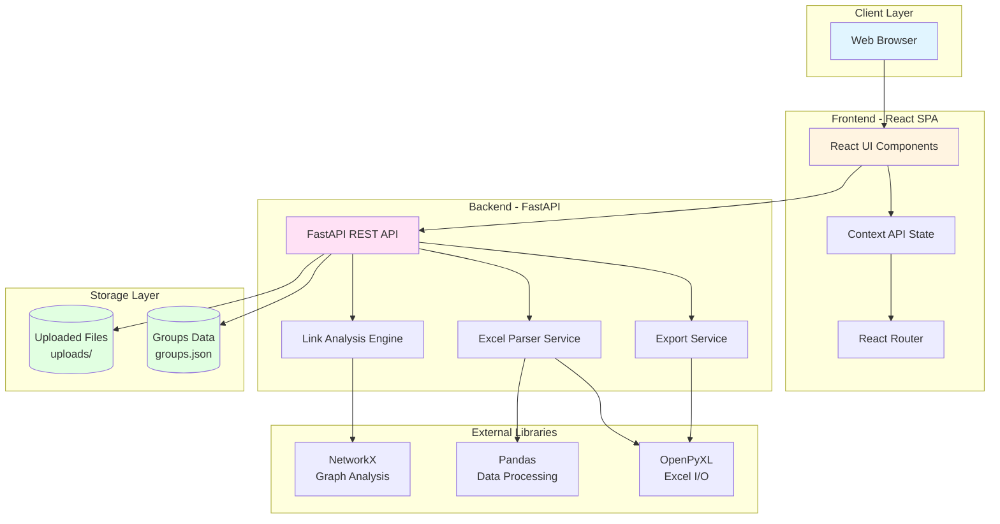
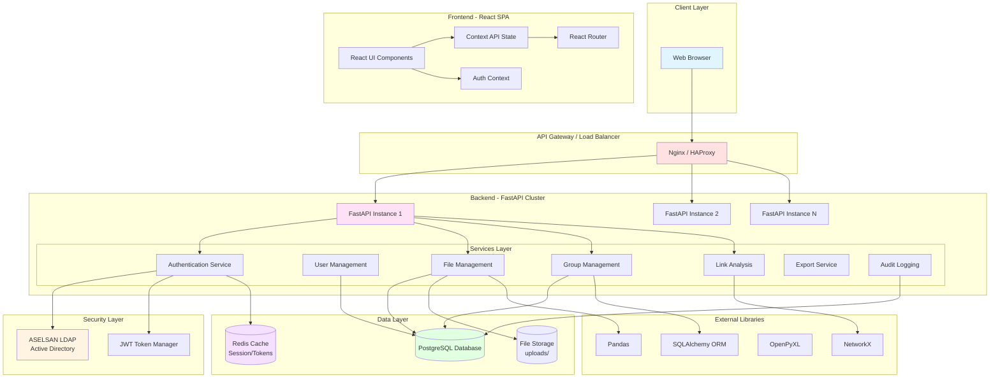
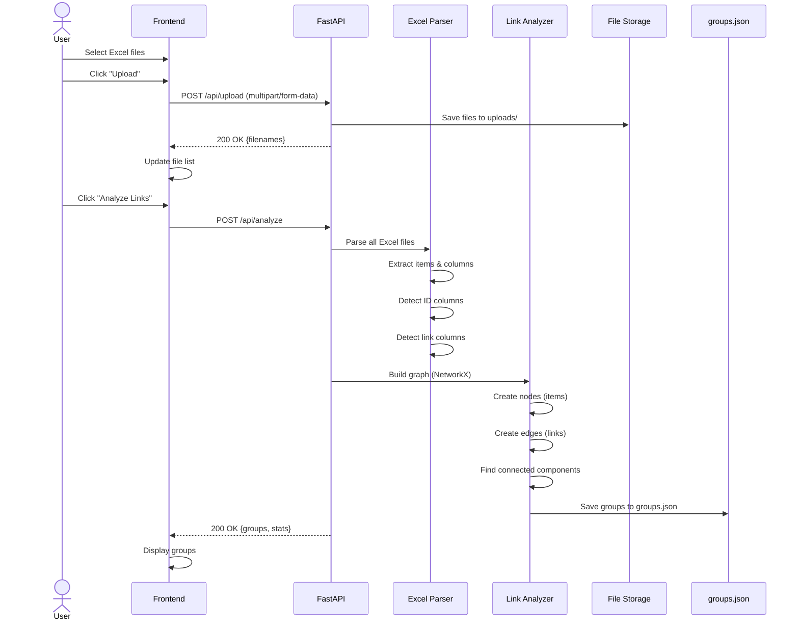
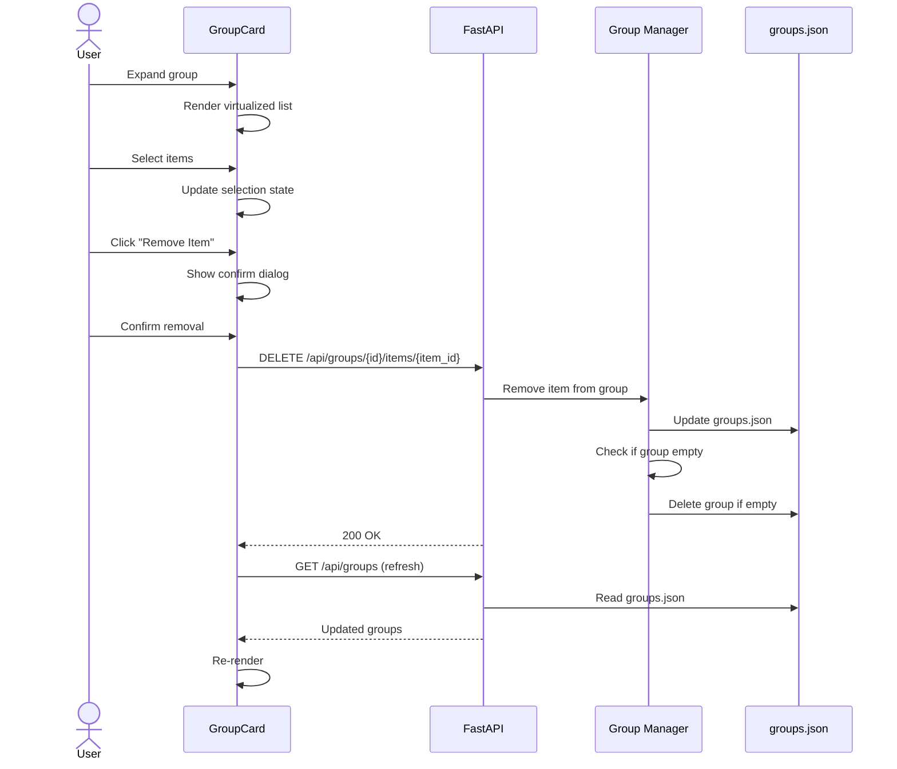
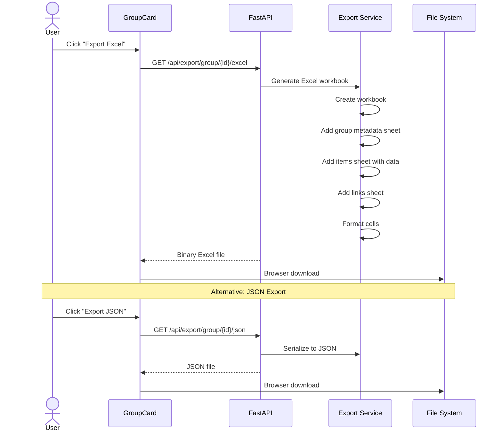
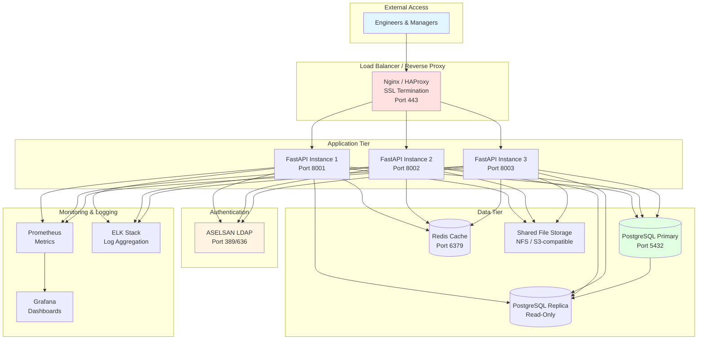

# ASEL Trace - High-Level Architecture Documentation

## Table of Contents
1. [System Architecture (Current)](#1-system-architecture-current)
2. [System Architecture (Future - With Database)](#2-system-architecture-future)
3. [Component Diagram](#3-component-diagram)
4. [Data Flow Diagram](#4-data-flow-diagram)
5. [Deployment Architecture](#5-deployment-architecture)
6. [Technology Stack](#6-technology-stack)

---

## 1. System Architecture (Current)



### Current Architecture Characteristics

**Strengths:**
- ✅ Simple deployment (no database setup)
- ✅ Fast development iteration
- ✅ Easy backup (copy files and JSON)
- ✅ Low infrastructure requirements

**Limitations:**
- ❌ No user authentication/authorization
- ❌ No audit trail
- ❌ File-based storage not scalable
- ❌ No concurrent user support
- ❌ Risk of data corruption with simultaneous writes

---

## 2. System Architecture (Future)



### Future Architecture Characteristics

**Benefits:**
- ✅ Multi-user support with authentication
- ✅ Role-based access control (RBAC)
- ✅ Audit trail for compliance
- ✅ Horizontal scalability (multiple instances)
- ✅ Session management with Redis
- ✅ Corporate SSO integration (LDAP)
- ✅ Data consistency with ACID transactions

---

## 3. Component Diagram

```mermaid
graph LR
    subgraph "Frontend Components"
        Header[Header Component]
        FileUpload[File Upload]
        FileExplorer[File Explorer]
        FileViewer[File Viewer Modal]
        GroupList[Group List]
        GroupCard[Group Card]
        OrphanedItems[Orphaned Items]

        Header --> FileUpload
        FileUpload --> FileExplorer
        FileExplorer --> FileViewer
        FileUpload --> GroupList
        GroupList --> GroupCard
        FileUpload --> OrphanedItems
    end

    subgraph "Context Providers"
        AppContext[App Context<br/>Global State]
        ThemeContext[Theme Context<br/>Dark/Light Mode]
        ToastContext[Toast Context<br/>Notifications]
        ConfirmContext[Confirm Context<br/>Dialogs]

        AppContext --> FileUpload
        AppContext --> GroupList
        ThemeContext --> Header
        ToastContext --> FileUpload
        ConfirmContext --> GroupCard
    end

    subgraph "Backend Routes"
        UploadRoute[/api/upload<br/>File Upload]
        FilesRoute[/api/files<br/>File Management]
        AnalyzeRoute[/api/analyze<br/>Link Analysis]
        GroupsRoute[/api/groups<br/>Group CRUD]
        ItemsRoute[/api/items<br/>Item Management]
        ExportRoute[/api/export<br/>Data Export]
    end

    subgraph "Backend Services"
        ExcelParser[Excel Parser<br/>pandas + openpyxl]
        LinkAnalyzer[Link Analyzer<br/>NetworkX]
        GroupManager[Group Manager<br/>CRUD Operations]
        FileManager[File Manager<br/>I/O Operations]
        Exporter[Export Service<br/>JSON + Excel]
    end

    FileUpload -.HTTP.-> UploadRoute
    FileExplorer -.HTTP.-> FilesRoute
    FileUpload -.HTTP.-> AnalyzeRoute
    GroupList -.HTTP.-> GroupsRoute
    GroupCard -.HTTP.-> ItemsRoute
    GroupCard -.HTTP.-> ExportRoute

    UploadRoute --> FileManager
    FilesRoute --> FileManager
    AnalyzeRoute --> ExcelParser
    AnalyzeRoute --> LinkAnalyzer
    GroupsRoute --> GroupManager
    ExportRoute --> Exporter

    style FileUpload fill:#e1f5ff
    style GroupCard fill:#e1f5ff
    style AppContext fill:#fff4e1
    style UploadRoute fill:#ffe1f5
    style ExcelParser fill:#e1ffe1
```

---

## 4. Data Flow Diagram

### 4.1 File Upload & Analysis Flow



### 4.2 Group Management Flow



### 4.3 Export Flow



---

## 5. Deployment Architecture

### 5.1 Current Deployment (Development/Staging)

```mermaid
graph TB
    subgraph "ASELSAN Intranet Server"
        subgraph "Docker Containers"
            Frontend[Frontend Container<br/>Nginx + React Build<br/>Port 80/443]
            Backend[Backend Container<br/>FastAPI + Uvicorn<br/>Port 8000]
        end

        subgraph "Volumes"
            Uploads[/uploads<br/>Persistent Volume]
            Data[/data<br/>groups.json]
        end

        Frontend --> Backend
        Backend --> Uploads
        Backend --> Data
    end

    subgraph "Client Workstations"
        Engineer1[Engineer Browser]
        Engineer2[Engineer Browser]
        Engineer3[Engineer Browser]
    end

    Engineer1 --> Frontend
    Engineer2 --> Frontend
    Engineer3 --> Frontend

    style Frontend fill:#e1f5ff
    style Backend fill:#ffe1f5
    style Uploads fill:#e1ffe1
```

**Docker Compose Setup:**
```yaml
services:
  frontend:
    image: nginx:alpine
    ports: ["80:80", "443:443"]
    volumes:
      - ./frontend/dist:/usr/share/nginx/html
      - ./nginx.conf:/etc/nginx/nginx.conf

  backend:
    image: python:3.11
    ports: ["8000:8000"]
    volumes:
      - ./backend:/app
      - uploads:/app/uploads
      - data:/app/data
    command: uvicorn main:app --host 0.0.0.0
```

### 5.2 Future Deployment (Production with Database)



**Production Infrastructure Requirements:**
- **Load Balancer**: 1 instance (Nginx/HAProxy)
- **Application Servers**: 3+ instances (horizontal scaling)
- **Database**: 1 Primary + 1 Replica (HA setup)
- **Cache**: 1 Redis instance (or cluster)
- **File Storage**: NFS share or S3-compatible storage
- **Monitoring**: Prometheus + Grafana
- **Logging**: ELK stack or similar

---

## 6. Technology Stack

### Frontend Stack
```
├── React 18                    # UI Framework
├── Vite                        # Build Tool
├── Tailwind CSS                # Styling
├── react-window                # Virtualization
├── lucide-react                # Icons
├── react-dropzone              # File Upload
└── Context API                 # State Management
```

### Backend Stack
```
├── Python 3.11+                # Runtime
├── FastAPI                     # Web Framework
├── Uvicorn                     # ASGI Server
├── Pydantic                    # Data Validation
├── pandas                      # Data Processing
├── openpyxl                    # Excel I/O
├── NetworkX                    # Graph Analysis
├── SQLAlchemy (Future)         # ORM
├── Alembic (Future)            # Migrations
└── python-ldap (Future)        # LDAP Auth
```

### Infrastructure
```
├── Docker & Docker Compose     # Containerization
├── PostgreSQL (Future)         # Database
├── Redis (Future)              # Cache
├── Nginx                       # Web Server / Reverse Proxy
├── ASELSAN LDAP                # Authentication
└── Git                         # Version Control
```

### Development Tools
```
├── Git                         # Version Control
├── npm                         # Package Manager (Frontend)
├── pip / Poetry                # Package Manager (Backend)
├── ESLint                      # Linting (Frontend)
├── Black                       # Formatting (Backend)
└── pytest                      # Testing (Backend)
```

---

## 7. Security Considerations

### Current Security Measures
- ✅ CORS configuration
- ✅ Input validation with Pydantic
- ✅ File type validation (.xlsx, .xls only)
- ⚠️ No authentication/authorization
- ⚠️ No audit logging
- ⚠️ No rate limiting

### Future Security Enhancements
- ✅ LDAP authentication with corporate credentials
- ✅ JWT token-based session management
- ✅ Role-based access control (RBAC)
- ✅ Audit logging for all operations
- ✅ Rate limiting per user
- ✅ SQL injection protection (SQLAlchemy ORM)
- ✅ XSS protection (React + CSP headers)
- ✅ HTTPS/TLS encryption
- ✅ Secure file upload validation
- ✅ Database connection pooling with SSL

---

## 8. Performance Optimizations

### Frontend
- ✅ **Virtualization**: react-window for large lists (1000+ items)
- ✅ **Code Splitting**: Dynamic imports with React.lazy
- ✅ **Memoization**: React.memo for expensive components
- ✅ **Debouncing**: Search input with debounce
- ✅ **Lazy Loading**: Images and components on demand

### Backend
- ✅ **Async I/O**: FastAPI async/await for non-blocking operations
- 🔄 **Database Indexing**: Strategic indexes on frequently queried columns
- 🔄 **Connection Pooling**: Reuse database connections
- 🔄 **Caching**: Redis for frequently accessed data
- 🔄 **Pagination**: Limit result sets for large queries

### Infrastructure
- 🔄 **CDN**: Static asset caching
- 🔄 **Compression**: Gzip/Brotli for HTTP responses
- 🔄 **Load Balancing**: Distribute traffic across instances
- 🔄 **Database Replication**: Read replicas for query distribution

Legend: ✅ Implemented | 🔄 Planned for future

---

## Document Version
- **Version**: 1.0
- **Last Updated**: 2025-01-04
- **Author**: Development Team
- **Status**: Living Document

