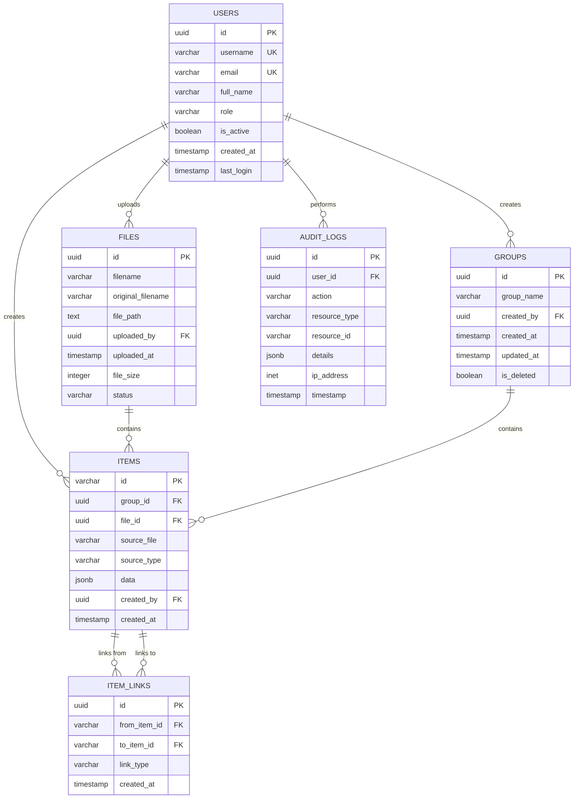

# ASEL Trace - Database Schema Design

## Entity-Relationship Diagram



---

## Table Definitions

### 1. Users Table

Stores user accounts and authentication information.

```sql
CREATE TABLE users (
    id UUID PRIMARY KEY DEFAULT gen_random_uuid(),
    username VARCHAR(100) UNIQUE NOT NULL,
    email VARCHAR(255) UNIQUE NOT NULL,
    full_name VARCHAR(255),
    role VARCHAR(50) NOT NULL DEFAULT 'engineer',
    is_active BOOLEAN DEFAULT true,
    created_at TIMESTAMP DEFAULT CURRENT_TIMESTAMP,
    last_login TIMESTAMP,

    CONSTRAINT check_role CHECK (role IN ('admin', 'engineer', 'viewer'))
);

-- Indexes
CREATE INDEX idx_users_username ON users(username);
CREATE INDEX idx_users_email ON users(email);
CREATE INDEX idx_users_role ON users(role);
CREATE INDEX idx_users_is_active ON users(is_active);

-- Sample Data
INSERT INTO users (username, email, full_name, role) VALUES
('admin', 'admin@aselsan.com.tr', 'System Administrator', 'admin'),
('ahmet.yilmaz', 'ahmet.yilmaz@aselsan.com.tr', 'Ahmet Yılmaz', 'engineer'),
('ayse.kaya', 'ayse.kaya@aselsan.com.tr', 'Ayşe Kaya', 'viewer');
```

**Columns:**
- `id`: Primary key (UUID)
- `username`: LDAP username (unique)
- `email`: Corporate email (unique)
- `full_name`: Display name
- `role`: User role (admin, engineer, viewer)
- `is_active`: Account status (soft delete)
- `created_at`: Account creation timestamp
- `last_login`: Last successful login

---

### 2. Files Table

Stores metadata about uploaded Excel files.

```sql
CREATE TABLE files (
    id UUID PRIMARY KEY DEFAULT gen_random_uuid(),
    filename VARCHAR(255) NOT NULL,
    original_filename VARCHAR(255) NOT NULL,
    file_path TEXT NOT NULL,
    uploaded_by UUID REFERENCES users(id) ON DELETE SET NULL,
    uploaded_at TIMESTAMP DEFAULT CURRENT_TIMESTAMP,
    file_size INTEGER,
    status VARCHAR(50) DEFAULT 'active',

    CONSTRAINT check_status CHECK (status IN ('active', 'deleted', 'archived'))
);

-- Indexes
CREATE INDEX idx_files_uploaded_by ON files(uploaded_by);
CREATE INDEX idx_files_uploaded_at ON files(uploaded_at DESC);
CREATE INDEX idx_files_status ON files(status);
CREATE INDEX idx_files_filename ON files(filename);
```

**Columns:**
- `id`: Primary key (UUID)
- `filename`: Stored filename (with timestamp)
- `original_filename`: User's original filename
- `file_path`: Full path to file on disk
- `uploaded_by`: User who uploaded (FK to users)
- `uploaded_at`: Upload timestamp
- `file_size`: File size in bytes
- `status`: File status (active, deleted, archived)

**Business Rules:**
- When user deletes file, set status='deleted' (soft delete)
- Keep file metadata even if user is deleted (ON DELETE SET NULL)
- Original filename preserved for display

---

### 3. Groups Table

Stores requirement groups (connected components).

```sql
CREATE TABLE groups (
    id UUID PRIMARY KEY DEFAULT gen_random_uuid(),
    group_name VARCHAR(255) NOT NULL,
    created_by UUID REFERENCES users(id) ON DELETE SET NULL,
    created_at TIMESTAMP DEFAULT CURRENT_TIMESTAMP,
    updated_at TIMESTAMP DEFAULT CURRENT_TIMESTAMP,
    is_deleted BOOLEAN DEFAULT false
);

-- Indexes
CREATE INDEX idx_groups_created_by ON groups(created_by);
CREATE INDEX idx_groups_created_at ON groups(created_at DESC);
CREATE INDEX idx_groups_is_deleted ON groups(is_deleted);
CREATE INDEX idx_groups_name ON groups(group_name);

-- Trigger to update updated_at
CREATE OR REPLACE FUNCTION update_updated_at_column()
RETURNS TRIGGER AS $$
BEGIN
    NEW.updated_at = CURRENT_TIMESTAMP;
    RETURN NEW;
END;
$$ language 'plpgsql';

CREATE TRIGGER update_groups_updated_at
    BEFORE UPDATE ON groups
    FOR EACH ROW
    EXECUTE FUNCTION update_updated_at_column();
```

**Columns:**
- `id`: Primary key (UUID)
- `group_name`: Display name for the group
- `created_by`: User who created group (FK to users)
- `created_at`: Creation timestamp
- `updated_at`: Last modification timestamp
- `is_deleted`: Soft delete flag

**Business Rules:**
- Soft delete only (preserve history)
- Auto-update `updated_at` on any modification
- Group name can be edited by creator or admin

---

### 4. Items Table

Stores individual requirements/items from Excel files.

```sql
CREATE TABLE items (
    id VARCHAR(100) PRIMARY KEY,
    group_id UUID REFERENCES groups(id) ON DELETE CASCADE,
    file_id UUID REFERENCES files(id) ON DELETE SET NULL,
    source_file VARCHAR(255),
    source_type VARCHAR(50) DEFAULT 'excel',
    data JSONB NOT NULL,
    created_by UUID REFERENCES users(id) ON DELETE SET NULL,
    created_at TIMESTAMP DEFAULT CURRENT_TIMESTAMP,

    CONSTRAINT check_source_type CHECK (source_type IN ('excel', 'manual'))
);

-- Indexes
CREATE INDEX idx_items_group_id ON items(group_id);
CREATE INDEX idx_items_file_id ON items(file_id);
CREATE INDEX idx_items_source_file ON items(source_file);
CREATE INDEX idx_items_source_type ON items(source_type);
CREATE INDEX idx_items_created_by ON items(created_by);
CREATE INDEX idx_items_created_at ON items(created_at DESC);

-- GIN index for JSONB queries
CREATE INDEX idx_items_data_gin ON items USING gin(data);

-- Index for specific JSONB fields (if known)
CREATE INDEX idx_items_data_title ON items USING gin((data->'Requirement Title'));
```

**Columns:**
- `id`: Item identifier (e.g., REQ-001, UC-042)
- `group_id`: Parent group (FK to groups, CASCADE delete)
- `file_id`: Source Excel file (FK to files)
- `source_file`: Original filename for display
- `source_type`: How item was created (excel, manual)
- `data`: Flexible JSONB storage for all item fields
- `created_by`: User who created (for manual items)
- `created_at`: Creation timestamp

**JSONB Data Structure:**
```json
{
  "Requirement Title": "System shall authenticate users",
  "Description": "The system shall authenticate users via LDAP",
  "Priority": "High",
  "Status": "Approved",
  "in_links": ["REQ-001", "REQ-003"],
  "out_links": ["UC-042", "TC-100"]
}
```

**Business Rules:**
- Cascade delete when group is deleted
- Preserve item if file is deleted (ON DELETE SET NULL)
- JSONB allows flexible schema for different Excel formats
- GIN index enables fast JSONB queries

**Example Queries:**
```sql
-- Find items by title
SELECT * FROM items
WHERE data->>'Requirement Title' ILIKE '%authentication%';

-- Find items with specific status
SELECT * FROM items
WHERE data->>'Status' = 'Approved';

-- Find items with in_links
SELECT * FROM items
WHERE data->'in_links' IS NOT NULL
  AND jsonb_array_length(data->'in_links') > 0;
```

---

### 5. Item Links Table

Stores relationships between items (normalized from JSONB).

```sql
CREATE TABLE item_links (
    id UUID PRIMARY KEY DEFAULT gen_random_uuid(),
    from_item_id VARCHAR(100) REFERENCES items(id) ON DELETE CASCADE,
    to_item_id VARCHAR(100) REFERENCES items(id) ON DELETE CASCADE,
    link_type VARCHAR(50),
    created_at TIMESTAMP DEFAULT CURRENT_TIMESTAMP,

    CONSTRAINT unique_link UNIQUE(from_item_id, to_item_id),
    CONSTRAINT no_self_link CHECK (from_item_id != to_item_id)
);

-- Indexes
CREATE INDEX idx_item_links_from ON item_links(from_item_id);
CREATE INDEX idx_item_links_to ON item_links(to_item_id);
CREATE INDEX idx_item_links_type ON item_links(link_type);
CREATE INDEX idx_item_links_created_at ON item_links(created_at DESC);
```

**Columns:**
- `id`: Primary key (UUID)
- `from_item_id`: Source item (FK to items)
- `to_item_id`: Target item (FK to items)
- `link_type`: Type of link (e.g., 'parent', 'related')
- `created_at`: Link creation timestamp

**Business Rules:**
- Cascade delete when either item is deleted
- Prevent duplicate links (UNIQUE constraint)
- Prevent self-links (CHECK constraint)
- Bidirectional relationships require two records

**Link Graph Queries:**
```sql
-- Get all outgoing links from an item
SELECT to_item_id
FROM item_links
WHERE from_item_id = 'REQ-001';

-- Get all incoming links to an item
SELECT from_item_id
FROM item_links
WHERE to_item_id = 'REQ-001';

-- Get bidirectional connections
SELECT from_item_id, to_item_id
FROM item_links
WHERE from_item_id = 'REQ-001'
   OR to_item_id = 'REQ-001';

-- Find items with no links (orphaned)
SELECT i.id
FROM items i
LEFT JOIN item_links l1 ON i.id = l1.from_item_id
LEFT JOIN item_links l2 ON i.id = l2.to_item_id
WHERE l1.id IS NULL AND l2.id IS NULL;
```

---

### 6. Audit Logs Table

Comprehensive audit trail for compliance and debugging.

```sql
CREATE TABLE audit_logs (
    id UUID PRIMARY KEY DEFAULT gen_random_uuid(),
    user_id UUID REFERENCES users(id) ON DELETE SET NULL,
    action VARCHAR(100) NOT NULL,
    resource_type VARCHAR(50),
    resource_id VARCHAR(255),
    details JSONB,
    ip_address INET,
    timestamp TIMESTAMP DEFAULT CURRENT_TIMESTAMP
);

-- Indexes
CREATE INDEX idx_audit_logs_user_id ON audit_logs(user_id);
CREATE INDEX idx_audit_logs_action ON audit_logs(action);
CREATE INDEX idx_audit_logs_resource_type ON audit_logs(resource_type);
CREATE INDEX idx_audit_logs_resource_id ON audit_logs(resource_id);
CREATE INDEX idx_audit_logs_timestamp ON audit_logs(timestamp DESC);

-- Partitioning by month (for large datasets)
CREATE TABLE audit_logs_2025_01 PARTITION OF audit_logs
    FOR VALUES FROM ('2025-01-01') TO ('2025-02-01');
```

**Columns:**
- `id`: Primary key (UUID)
- `user_id`: User who performed action (FK to users)
- `action`: Action performed (e.g., 'upload_file', 'delete_group')
- `resource_type`: Type of resource (e.g., 'file', 'group', 'item')
- `resource_id`: ID of affected resource
- `details`: JSONB with additional context
- `ip_address`: Client IP address
- `timestamp`: When action occurred

**Auditable Actions:**
- `login` / `logout`
- `upload_file` / `delete_file`
- `create_group` / `update_group` / `delete_group`
- `create_item` / `update_item` / `remove_item`
- `export_json` / `export_excel`
- `assign_to_group`

**Details JSONB Structure:**
```json
{
  "old_value": "Group 1",
  "new_value": "Requirements Group 1",
  "affected_items": ["REQ-001", "REQ-002"],
  "changes": {
    "group_name": "Requirements Group 1"
  }
}
```

**Example Queries:**
```sql
-- User activity log
SELECT action, resource_type, timestamp
FROM audit_logs
WHERE user_id = 'uuid-here'
ORDER BY timestamp DESC
LIMIT 100;

-- Group deletion history
SELECT * FROM audit_logs
WHERE action = 'delete_group'
  AND timestamp > NOW() - INTERVAL '30 days';

-- Track changes to specific item
SELECT * FROM audit_logs
WHERE resource_type = 'item'
  AND resource_id = 'REQ-001'
ORDER BY timestamp DESC;
```

---

## Views (Materialized for Performance)

### 1. Group Statistics View

```sql
CREATE MATERIALIZED VIEW group_stats AS
SELECT
    g.id AS group_id,
    g.group_name,
    COUNT(DISTINCT i.id) AS item_count,
    COUNT(DISTINCT i.file_id) AS file_count,
    COUNT(DISTINCT i.source_file) AS source_file_count,
    MIN(i.created_at) AS oldest_item,
    MAX(i.created_at) AS newest_item,
    u.full_name AS created_by_name
FROM groups g
LEFT JOIN items i ON g.id = i.group_id
LEFT JOIN users u ON g.created_by = u.id
WHERE g.is_deleted = false
GROUP BY g.id, g.group_name, u.full_name;

-- Refresh materialized view after data changes
CREATE INDEX idx_group_stats_id ON group_stats(group_id);

-- Refresh command
REFRESH MATERIALIZED VIEW group_stats;
```

### 2. Item Links Summary View

```sql
CREATE MATERIALIZED VIEW item_links_summary AS
SELECT
    i.id,
    i.group_id,
    COUNT(l_out.id) AS outgoing_links_count,
    COUNT(l_in.id) AS incoming_links_count,
    COUNT(l_out.id) + COUNT(l_in.id) AS total_links_count
FROM items i
LEFT JOIN item_links l_out ON i.id = l_out.from_item_id
LEFT JOIN item_links l_in ON i.id = l_in.to_item_id
GROUP BY i.id, i.group_id;

CREATE INDEX idx_item_links_summary_id ON item_links_summary(id);
```

---

## Migration Strategy

### Phase 1: Schema Creation
```sql
-- Run schema creation scripts
\i schema.sql
```

### Phase 2: Data Migration from groups.json

```python
# Python migration script
import json
import psycopg2
from uuid import uuid4

# Load existing groups.json
with open('backend/data/groups.json', 'r') as f:
    groups_data = json.load(f)

conn = psycopg2.connect(DATABASE_URL)
cursor = conn.cursor()

# Create default system user
system_user_id = str(uuid4())
cursor.execute("""
    INSERT INTO users (id, username, email, full_name, role)
    VALUES (%s, 'system', 'system@aselsan.com.tr', 'System Migration', 'admin')
""", (system_user_id,))

# Migrate each group
for group_data in groups_data['groups']:
    group_id = str(uuid4())

    # Insert group
    cursor.execute("""
        INSERT INTO groups (id, group_name, created_by)
        VALUES (%s, %s, %s)
    """, (group_id, group_data['group_name'], system_user_id))

    # Insert items
    for item in group_data['items']:
        cursor.execute("""
            INSERT INTO items (id, group_id, source_file, source_type, data, created_by)
            VALUES (%s, %s, %s, %s, %s, %s)
        """, (
            item['id'],
            group_id,
            item['source_file'],
            item.get('source_type', 'excel'),
            json.dumps(item['data']),
            system_user_id
        ))

        # Insert links
        for link_to in item.get('out_links', []):
            cursor.execute("""
                INSERT INTO item_links (from_item_id, to_item_id)
                VALUES (%s, %s)
                ON CONFLICT DO NOTHING
            """, (item['id'], link_to))

conn.commit()
cursor.close()
conn.close()
```

### Phase 3: Verify Migration

```sql
-- Verify counts match
SELECT 'Groups' AS entity, COUNT(*) FROM groups
UNION ALL
SELECT 'Items', COUNT(*) FROM items
UNION ALL
SELECT 'Links', COUNT(*) FROM item_links;

-- Check data integrity
SELECT g.group_name, COUNT(i.id) AS item_count
FROM groups g
LEFT JOIN items i ON g.id = i.group_id
GROUP BY g.id, g.group_name
ORDER BY item_count DESC;
```

---

## Database Maintenance

### Backup Strategy
```bash
# Daily automated backup
pg_dump -U postgres -F c -b -v -f "backup_$(date +%Y%m%d).dump" asel_trace

# Restore from backup
pg_restore -U postgres -d asel_trace -v backup_20250104.dump
```

### Index Maintenance
```sql
-- Reindex regularly (monthly)
REINDEX DATABASE asel_trace;

-- Vacuum analyze (weekly)
VACUUM ANALYZE;

-- Check index usage
SELECT schemaname, tablename, indexname, idx_scan
FROM pg_stat_user_indexes
ORDER BY idx_scan ASC;
```

### Performance Monitoring
```sql
-- Slow queries
SELECT query, calls, total_time, mean_time
FROM pg_stat_statements
ORDER BY mean_time DESC
LIMIT 10;

-- Table sizes
SELECT
    schemaname,
    tablename,
    pg_size_pretty(pg_total_relation_size(schemaname||'.'||tablename)) AS size
FROM pg_tables
WHERE schemaname = 'public'
ORDER BY pg_total_relation_size(schemaname||'.'||tablename) DESC;
```

---

## Document Version
- **Version**: 1.0
- **Last Updated**: 2025-01-04
- **Status**: Design Document (Not Yet Implemented)

